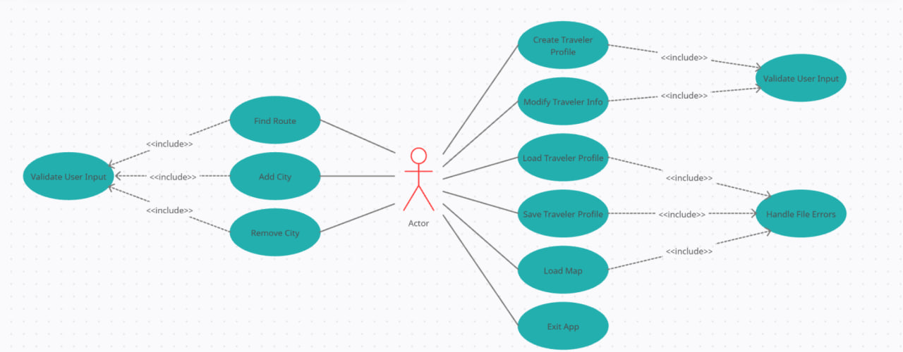
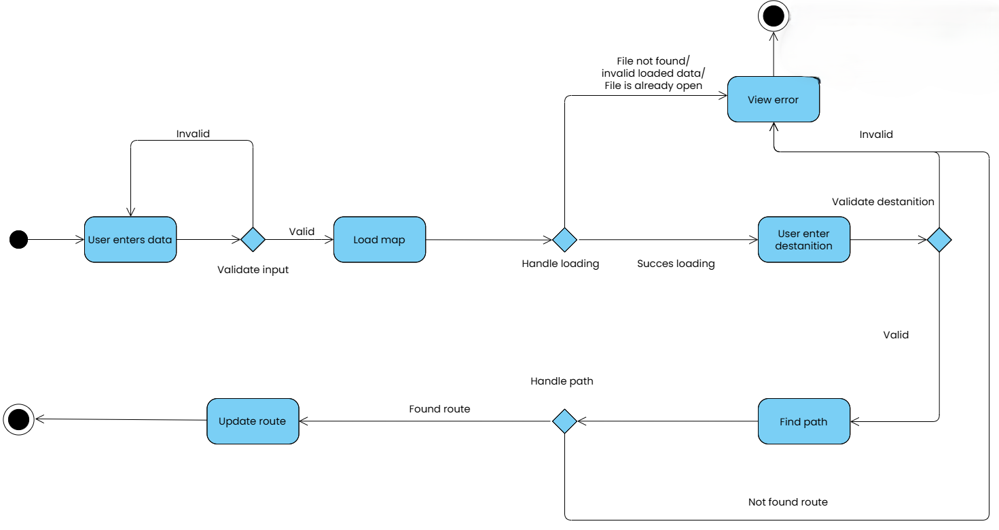
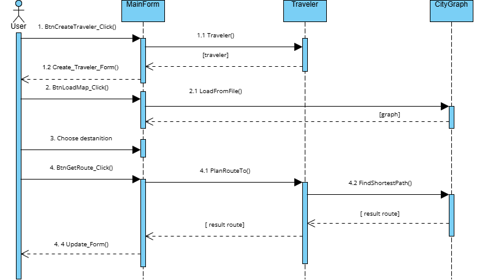

## Table of Contents
1.  [Use Case Diagram](#use-case-diagram)
2.  [Activity Diagram](#activity-diagram)
3.  [Sequence Diagram](#sequence-diagram)

---

# Use Case Diagram

This UML Use Case diagram illustrates the primary functionalities of the system (likely a travel planning application) and how an **Actor** (the User) interacts with it.



---

## Primary Actor

* **Actor (User):** The single actor in the system who initiates all primary use cases.

---

## Main Use Cases

The Actor can perform the following main actions:

### 1. Route Management
* `Find Route`
* `Add City`
* `Remove City`

### 2. Traveler Profile Management
* `Create Traveler Profile`
* `Modify Traveler Info`
* `Load Traveler Profile`
* `Save Traveler Profile`

### 3. Core Application Functions
* `Load Map`
* `Exit App`
> [!NOTE]
> The user can also create a new map when they start adding cities (using the `AddCity` use case).
---

## Supporting Use Cases (`<<include>>` Dependencies)

The diagram also defines two supporting use cases that are mandatory, included components of other, larger scenarios:

### `Validate User Input`
* **Included by:** `Find Route`, `Add City`, `Remove City`, `Create Traveler Profile`, and `Modify Traveler Info`.
* **Purpose:** To ensure that any data entered by the user for these operations (e.g., city names, profile details) is validated for correctness before being processed.
> [!NOTE]
> The user will not be able to delete a city if there are no more than 2 of them

### `Handle File Errors`
* **Included by:** `Load Traveler Profile`, `Save Traveler Profile` and `Load Map`.
* **Purpose:** To provide robust exception and error handling for operations involving reading or writing the profile file (e.g., "file not found," "access denied").
> [!IMPORTANT]
> **File Structures**
> 
> **traveler.json**
> ```json
> {
>   "name": "name",
>   "currentLocation": "cityA",
>   "route": ["cityA", "cityB", "cityC"]
> }
> ```
> 
> **map.txt**
> ```
> CityA-CityB, distance
> CityB-CityC, distance
> ```
# Activity Diagram

This UML Activity Diagram details the step-by-step flow for the "Find Route" functionality. It shows the process from the initial user input to the final route update, including validation, error handling, and decision loops.



---

## Process Flow Description

The process starts with the user initiating the action (black start node).

1.  **User Enters Data:** The user provides initial data.
2.  **Validate Input (Decision):**
    * If the data is `Invalid`, the system loops back, prompting the user to re-enter the data.
    * If the data is `Valid`, the flow proceeds to `Load map`.
3.  **Load Map:** The system attempts to load the necessary map data.
4.  **Handle Loading (Decision):**
    * If loading fails (e.g., `File not found/invalid loaded data/File is already open`), the process moves to `View error`.
    * If loading is successful (`Succes loading`), the user is prompted to `User enter destantition` (enter destination).
5.  **User Enter Destination:** The user inputs their desired destination.
6.  **Validate Destination (Decision):**
    * If the destination is `Invalid`, the process moves to `View error`.
    * If the destination is `Valid`, the system proceeds to `Find path`.
7.  **View Error:** An error message is displayed to the user. After this step, the process terminates (moves to the upper end node).
8.  **Find Path:** The system attempts to calculate a route based on the valid inputs.
9.  **Handle Path (Decision):**
    * If a route is `Not found route`, the system loops back, prompting the user to `User enter destantition` again.
    * If a route is `Found route`, the system proceeds to `Update route`.
10. **Update Route:** The calculated route is finalized and displayed or saved.
11. **End Node:** After the route is updated, the process completes.

# Sequence Diagram

This UML Sequence Diagram illustrates the order of interactions between different objects in the system when a user performs a series of actions: creating a traveler profile, loading a map, and finding a route.



---

## Interaction Flow

The sequence of events is as follows:

### 1. Create Traveler Profile
1.1. The **User** clicks `BtnCreateTraveler_Click()` on the `:MainForm`.
1.2. The `:MainForm` instantiates a new `:Traveler` object (message `1.1 Traveler()`).
1.3. The `:MainForm` then calls `Create_Traveler_Form()` to update the UI (showing a new form). The `:Traveler` object is returned to the `:MainForm`.

### 2. Load Map
2.1. The **User** clicks `BtnLoadMap_Click()` on the `:MainForm`.
2.2. The `:MainForm` calls `LoadFromFile()` on the `:CityGraph` object.
2.3. The `:CityGraph` object loads the map data and returns the `[graph]` (map data) to the `:MainForm`.

### 3. Choose Destination
3.1. The **User** interacts with the `:MainForm` to `Choose destantition` (Choose destination).

### 4. Get Route
4.1. The **User** clicks `BtnGetRoute_Click()` on the `:MainForm`.
4.2. The `:MainForm` calls `PlanRouteTo()` on the `:Traveler` object.
4.3. The `:Traveler` object, in turn, calls `FindShortestPath()` on the `:CityGraph` object.
4.4. The `:CityGraph` calculates the route and returns the `[result route]` to the `:Traveler` object.
4.5. The `:Traveler` object returns the `[result route]` to the `:MainForm`.
4.6. Finally, the `:MainForm` calls `Update_Form()` to display the calculated route to the **User**.


